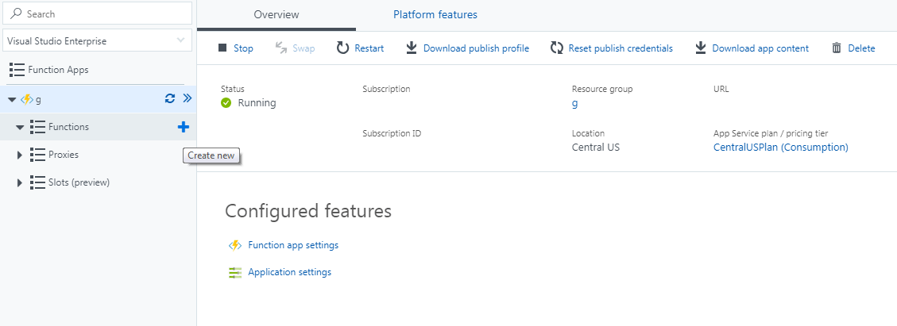

TODO SendGrid affiliate??

TODO Change code to my site

TODO Change directions to numbered list

The ability to create instructions & watch a computer do your bidding is often the thing that gets people addicted to writing software. These little one off tasks give you super human abilities to push a button & watch the magic unfold. One of the annoying things is you now need to run a computer 24/7. Otherwise you'll sit there waving your magic wand around watching nothing happen.

Azure, AWS & other providers offer awesome cloud services where you can run your magical instructions in the cloud without paying for a server to be on all the time. In fact, since you pay only for when you actually use it, a task that runs a few seconds once a day costs you almost nothing.

Let's take a look at how to create a task that get some data by making some requests to websites & then sending that data back to us via an e-mail once a day.

## Wizard, Meet Azure Functions

Login to Azure and click to *Create a Resource*. Here you can search for *Functions* and add a *Function App*.

On the next screen you can give the app a name, select a resource group, etc. If you're new to this, drop me a line in the comments & I can walk you through these steps. When your done, click *Create*.

Once Azure has your new resources ready, you can either click the pop up that appears or go to *All Resources* and find your Function App there. The Function App has a lightning bolt icon.

On the next screen, hover over *Functions* on the left menu, and click the + sign that appears.



Select *Timer* if you want to do this on a schedule or *Webhook+API* if you want a URL to send a request to so you can do it on demand. Also make sure C# is selected as the language below.

On the right side, click View Files.


Add a new `project.json` file and add the following text and then click the Save button:

```json
{
  "frameworks": {
    "net46":{
      "dependencies": {
        "HtmlAgilityPack": "1.8.2"
      }
    }
   }
}
```

Note: Currently only [.NET Framework 4.6 is supported on Azure Functions]( https://docs.microsoft.com/en-us/azure/azure-functions/functions-reference-csharp#using-nuget-packages).

For this demo, we'll scrape my website.

```csharp
#r "SendGrid"
using System.Net;
using HtmlAgilityPack;
using SendGrid.Helpers.Mail;

public static void Run(TimerInfo myTimer, TraceWriter log, out Mail message)
{
    var comics = GetLatestArticle().Result;
    try{
        message = new Mail {
            Subject = "Latest Article"
        };

        var personalization = new Personalization();
        personalization.AddTo(new Email("matt@mattferderer.com"));

        var content = new Content
        {
            Type = "text/html",
            Value = comics
        };
        message.AddContent(content);
        message.AddPersonalization(personalization);
    } catch (Exception e) {
        log.Info(e.ToString());
        message = SendEmail(e.ToString());
    }

}

public static async Task<string> GetLatestArticle() {
    string url = "https://mattferderer.com/";

    HttpClient client = new HttpClient();
    string html = await client.GetStringAsync(url);

    HtmlDocument doc = new HtmlDocument();
    doc.LoadHtml(html);

    var articles = doc.DocumentNode
        .SelectNodes("//div")
        .Where(x => x.Attributes.Contains("id") && x.Attributes["id"].Value.Contains("articles"))
        .FirstOrDefault();

    var link = articles
        .Element("a")
        .Attributes
        .Where(a => a.Name == "href")
        .FirstOrDefault()
        .Value;

    var text = articles
        .SelectNodes("//header")
        .Where(x => x.Attributes.Contains("class") && x.Attributes["class"].Value.Contains("post-header"))
        .FirstOrDefault()
        .Element("h2")
        .InnerText;

    return $"Latest Article: <a href=\"{url}\">{text}</a>";
}

public static Mail SendEmail(string input) {
    var message = new Mail
    {
        Subject = "New Comics"
    };

    var personalization = new Personalization();
    personalization.AddTo(new Email("matt@mattferderer.com"));

    Content content = new Content
    {
        Type = "text/html",
        Value = input
    };
    message.AddContent(content);
    message.AddPersonalization(personalization);
    return message;
}


```

Before we can get this to send an e-mail correctly we need to provide an e-mail service to our Azure account. I recommend SendGrid.

SendGrid offers easy Azure integration & a free developer plan. Beyond that, they have excellent service. For these reasons, they're my go to for fun apps, dev apps & especially production apps.

Create a SendGrid account and then go to settings > API Keys. Click create an API Key. Give it a name. Restricted access with Mail Send is all that is needed for access. Copy your API key.

Back in Azure, open your Functions Application Settings by clicking your app's name on the left menu and then Application Settings near the bottom under Configured features. (See highlighted links below)


Scroll down to the Application Settings, just above Connection strings and click Add new setting.

Add the key SendGridKey and a value of your API key Sendgrid gave you. Click save.

Under your functions name on the left, click Integrate & add a new Output. 

Select SendGrid from your list of Output options. 

In the SendGrid API Key drop down menu on the next screen, select SendGridKey.

Fill out the From address & subject as well if you want defaults for your function.  Make sure to Save. 

Your output settings will now be added to your function.json file that Azure created for you if you did a Timer Trigger app. You can also find your schedule using a Cron pattern in there. 

We'll now adjust our prior code. 

## TODO

Note debugging locally - VS Code - https://marketplace.visualstudio.com/items?itemName=ms-azuretools.vscode-azurefunctions

Visual Studio - https://docs.microsoft.com/en-us/azure/azure-functions/functions-develop-vs